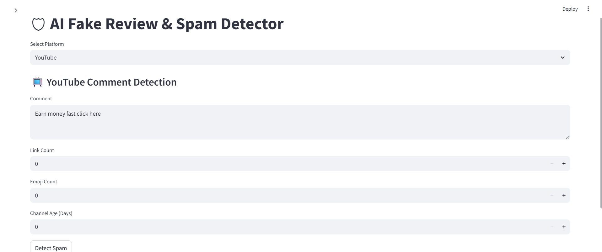
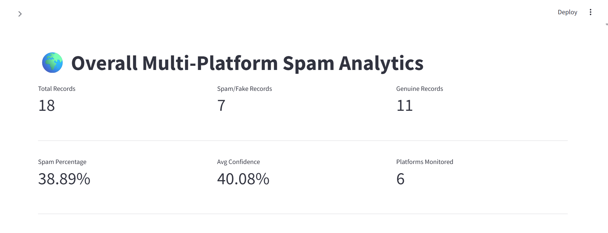
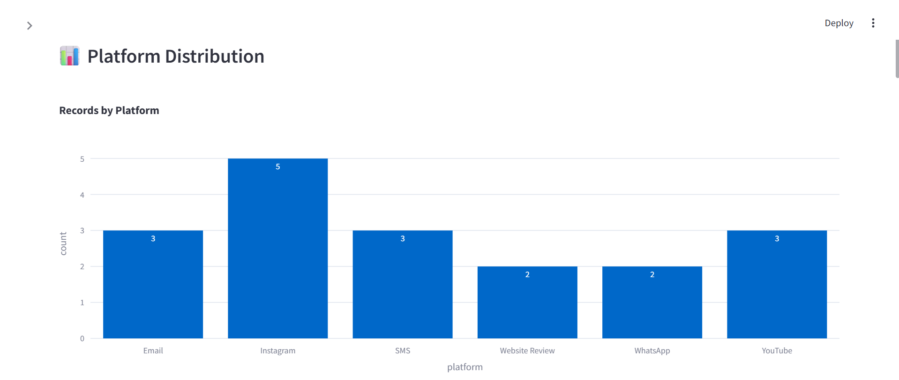
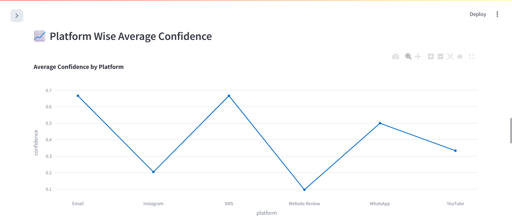

# 🛡 AI Multi-Platform Spam & Fake Review Detector

## 📌 Project Overview

The AI Multi-Platform Spam & Fake Review Detector is a Machine Learning-based web application developed using Streamlit.
It detects spam, phishing, fake reviews, and scam messages across multiple online platforms such as YouTube, Instagram, Email, SMS, Website Reviews, and WhatsApp.

The system analyzes various behavioral and textual features to classify content as either genuine or spam.

---

# 🚀 Features

* ✅ YouTube Spam Detection
* ✅ Instagram Fake Content Detection
* ✅ Email Phishing Detection
* ✅ SMS Scam Detection
* ✅ Website Fake Review Detection
* ✅ WhatsApp Scam Detection
* ✅ Confidence Score Prediction
* ✅ Risk Level Classification
* ✅ SQLite Database Storage
* ✅ Interactive Streamlit Dashboard

---

# 🧠 Technologies Used

| Technology   | Purpose              |
| ------------ | -------------------- |
| Python       | Backend Development  |
| Streamlit    | Web Application      |
| Pandas       | Data Processing      |
| Scikit-learn | Machine Learning     |
| SQLite       | Database Storage     |
| Joblib       | Model Saving/Loading |

---

# 🧪 Machine Learning Workflow

1. Data Collection
2. Data Preprocessing
3. Feature Engineering
4. Model Training
5. Prediction
6. Database Storage
7. Result Visualization

---

# 💾 Database Functionality

The application stores:

* Platform Name
* Input Text
* Prediction Result
* Confidence Score
* Feature Values

using SQLite database for future analysis.

---

# 🔮 Future Enhancements

* NLP Sentiment Analysis
* Deep Learning Integration
* Real-Time Spam API
* Advanced Dashboard Analytics
* PDF Report Generation
* User Authentication System

---

# 📸 Screenshots

 

  
  

  
  

---

